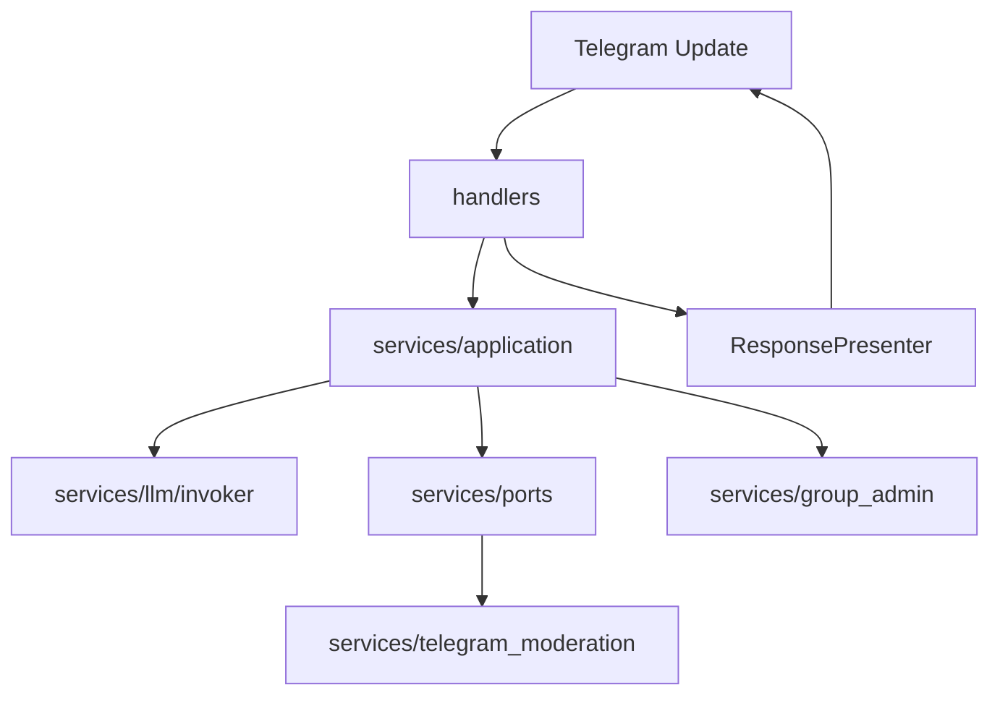

# Gemini Telegram Bot（喵喵）

Telegram 群聊/私聊 AI 机器人，支持多模型、流式回复、群管 tools 与 MCP 外挂执法。

## 目录说明

```
gemini_tg_bot/
├── main.py                 # 入口：初始化 DB、注册路由、启动轮询
├── handlers/               # 接口适配层（Telegram 入站/出站）
│   ├── messages.py         # 文本/语音/图片：薄 handler，编排交给 application
│   ├── callbacks.py        # 内联菜单、选模型、语音/系统角色等回调
│   ├── commands.py         # /start、/menu、/help
│   ├── admin.py            # 群管斜杠命令
│   └── states.py           # FSM 状态（如 ChangeValueState）
│
├── services/
│   ├── application/        # 应用编排层（用例，尽量不 import aiogram）
│   │   ├── dto.py          # IncomingChatContext、TextHandleResult 等
│   │   ├── message_use_cases.py   # HandleTextMessage / HandlePhotoMessage
│   │   ├── response_presenter.py  # 占位编辑、分片、语音状态
│   │   └── trigger_policy.py    # 群聊唤醒规则（@/回复/喵）
│   │
│   ├── llm/                # LLM 统一入口（业务只调 get_invoker）
│   │   ├── invoker.py      # chat / iter_chat / chat_with_tools / vision
│   │   ├── registry.py     # 读取 models/llm_models.yaml
│   │   ├── conversation.py # ConversationSnapshot 会话契约
│   │   ├── types.py        # LLMChatRequest、LLMVisionRequest
│   │   ├── messages.py     # 构建 OpenAI 风格 messages
│   │   └── adapters/       # nvidia / openrouter / gemini 适配
│   │
│   ├── ports/              # 端口（领域/应用依赖的抽象）
│   │   ├── moderation_port.py      # ModerationPort 接口 + Telegram 实现
│   │   ├── moderation_context.py   # ModerationToolContext（纯字段）
│   │   └── moderation_mapping.py   # Message → Context（仅接口层）
│   │
│   ├── group_admin/        # 群管（关键词 + 贝叶斯广告 + SQLite + 执法）
│   │   ├── manager.py      # GroupAdmin 单例（group_admin）
│   │   ├── keywords.py     # 违规词表与匹配
│   │   ├── bayes_spam/     # 朴素贝叶斯广告识别（参考 bayes_spam_sniper）
│   │   ├── policy.py       # GroupKeywordPolicy
│   │   ├── repo.py         # DB 路径等持久化约定
│   │   └── enforcement.py  # 执法动作迁移占位（实现仍在 manager）
│   │
│   ├── telegram_moderation.py  # Bot/MCP 共用的群管 API
│   ├── moderation_tools.py     # OpenAI function calling 工具定义与执行
│   ├── moderation_actions.py   # @@MOD 文本协议（非 tools 路径）
│   ├── group_context.py        # 群环境 system prompt 注入
│   ├── gemini.py / nvidia.py / openrouter.py  # 遗留直连（新功能请走 llm.invoker）
│   └── voice.py                # STT / TTS
│
├── models/
│   ├── llm_models.yaml     # 模型/提供商/菜单/能力 单一配置源
│   ├── model.yaml          # NVIDIA 调用示例（参考用）
│   ├── database.py         # 用户会话 SQLite
│   └── user.py
│
├── config/                 # 环境变量、按钮、性能参数
├── utils/                  # 流式上屏、Telegram 文本、引用合并等
├── mcp_server/             # 独立 MCP stdio 服务（复用 telegram_moderation）
└── data/                   # users_data.db、group_admin.db、bayes_spam.db
```

## 分层与调用关系

| 层级 | 职责 | 典型入口 |
|------|------|----------|
| **handlers** | 把 `Message`/`CallbackQuery` 转成 DTO，调用用例，用 Presenter 回消息 | `handlers/messages.py` |
| **application** | 编排：预审、拼 prompt、选流式/tools、写回会话 | `HandleTextMessageUseCase` |
| **llm** | 按 `llm_models.yaml` 路由到各 Provider | `get_invoker().chat(...)` |
| **ports** | 群管 tools 与 Telegram 解耦 | `get_moderation_port()` |
| **group_admin** | 关键词自动删禁、忽略列表、统计 | `group_admin.check_and_handle_message` |



## 开发约定

1. **加模型**：改 `models/llm_models.yaml`；**OpenRouter 免费模型** 用 `./manage.sh sync-openrouter`（需 `OPENROUTER_API_KEY`）拉取 API 写入 `models/openrouter_free_models.yaml`，菜单从 registry 自动生成。
2. **调大模型**：业务代码使用 `LLMChatRequest(model_id=..., conversation=ConversationSnapshot(...), ...)`，经 `get_invoker()` 调用，不要在新 handler 里直连 `nvidia.py` / `openrouter.py`。
3. **群广告拦截**：仅 **贝叶斯**（`group_admin/bayes_spam`，对齐 [bayes_spam_sniper](https://github.com/ramsayleung/bayes_spam_sniper/blob/master/README_zh.org)）；群聊 AI 执法另走 `chat_with_tools`。
4. **新功能**：逻辑写在 `services/application/` 或 `services/ports/`，handler 保持薄。

## 配置与环境变量

复制 `.env` 示例并配置至少：

- `TG_BOT_TOKEN` — Telegram Bot Token  
- `NVIDIA_API_KEY` 或 `GEMINI_API_KEY` / `OPENROUTER_API_KEY`（按所用模型）  
- OpenRouter 免费模型：配置 `OPENROUTER_API_KEY` 后执行 `./manage.sh sync-openrouter`（或 `uv run python scripts/sync_openrouter_free_models.py --list` 仅查看）  
- `OWNER_ID` — 允许使用机器人的 Telegram 用户 ID（逗号分隔）

常用性能项（见 `config/performance.py`）：

- `CHAT_MAX_OUTPUT_TOKENS` — 输出 token 上限  
- `NVIDIA_DISABLE_THINKING` — 关闭深度思考以加速  
- `GROUP_MOD_TOOLS_ENABLED` — 群聊 function calling 群管（默认开启）  
- `BAYES_SPAM_ENABLED` — 贝叶斯广告识别（默认开启）  
- `BAYES_SPAM_THRESHOLD` — 判定为广告的概率阈值（默认 `0.94`，与 bayes_spam_sniper 一致）  
- `BAYES_CHINESE_SPACE_THRESHOLD` — 汉字故意加空格规则阈值（默认 `0.8`）  
- `SPAM_BAN_THRESHOLD` — 同一用户在本群累计广告次数达此值封禁（默认 `3`，与 BSS 一致）  
- `STREAM_EDIT_INTERVAL_SEC` — 流式编辑间隔  

### 数据文件

| 文件 | 内容 |
|------|------|
| `data/users_data.db` | 用户对话、模型选择等 |
| `data/group_admin.db` | 封禁、警告、忽略名单、违规流水 |
| `data/bayes_spam.db` | **贝叶斯模型 + 广告记录**（`bayes_classifier_state`、`bayes_trained_samples`、`bayes_spam_log`） |

### 群管命令（对齐 [bayes_spam_sniper README](https://github.com/ramsayleung/bayes_spam_sniper/blob/master/README_zh.org)）

群内发送 **`/grouphelp`** 查看完整说明（含扩展命令）。🔒 = Telegram 群管理员。

#### 自动行为

仅 **贝叶斯广告识别**（+ 汉字加空格规则）：删消息；同一用户累计广告 ≥ 3 次（可配置）→ 封禁。与是否 @ 机器人无关。

#### 四类核心命令（与 BSS 相同）

| 命令 | 权限 | 说明 |
|------|------|------|
| `/markspam` | 🔒 | 回复垃圾消息：删除、封禁、训练为广告 |
| `/listbanuser` | 🔒 | 查看本群封禁列表；解封请回复该用户后 `/unban` |
| `/listspam` | 🔒 | 查看近期广告记录；误杀用 `/markham <编号>` |
| `/feedspam 文本` | 所有人 | 投喂广告样本训练（无需回复） |

#### 补充

| 命令 | 说明 |
|------|------|
| `/markham` | `/markham 12`（配合 listspam 编号）或回复消息标为正常 |
| `/grouphelp` | 完整命令说明 |

扩展手动群管（可选）：`/unban` `/del` `/mute` `/ban` `/kick` `/warn` `/ignore` `/unignore` `/ignorelist` `/stats`

#### AI 对话执法

@ 机器人 + 支持 tools 的模型 → function calling 检查引用消息（同样走贝叶斯，不再用关键词）。

## 运行与管理

先分清三件事（不要混用「启动」这个词）：

| 你要做的事 | 命令 | 实际效果 |
|------------|------|----------|
| **只装 Python 依赖** | `uv sync` | 创建/更新 `.venv`，**不跑任何服务** |
| **启动 Telegram 机器人** | `./manage.sh start` | 后台跑 `main.py`，连 Telegram 收消息（会先自动 `uv sync`） |
| **给 Cursor 配 MCP 群管** | `uv sync --extra mcp` + 配置 `mcp.json` | **只多装包**；MCP 由 Cursor 拉起，**不是** `manage.sh start` |

日常跑 Bot，一条命令即可（依赖会自动同步）：

```bash
chmod +x manage.sh run.sh
./manage.sh start      # ← 这才是「启动机器人」
./manage.sh status     # 看是否在跑
./manage.sh logs       # 实时看 logs/bot.log
```

进程管理：

| 命令 | 说明 |
|------|------|
| `./manage.sh start` | 后台启动 **Telegram Bot**（`nohup uv run main.py`） |
| `./manage.sh stop` | 停止 Bot（`pause` 同义） |
| `./manage.sh restart` | 重启 Bot |
| `./manage.sh status` | 是否在跑、PID、日志大小 |
| `./manage.sh logs` | `tail -f` 跟踪 `logs/bot.log` |

- **PID**：`data/bot.pid`  
- **日志**：`logs/bot.log`  

`run.sh` 仅为兼容入口，等价于 `./manage.sh start`。

首次部署前配置 `.env`（至少 `TG_BOT_TOKEN`、`OWNER_ID` 及所用模型的 API Key）。

### 仅安装依赖（不启动 Bot）

```bash
uv sync                 # 主依赖
uv sync --extra mcp     # 需要 Cursor MCP 群管时再装
```

### MCP 群管（可选，与 Bot 分开）

MCP 是 **Cursor 等编辑器** 通过 stdio 调群管 API，**不会**随 `./manage.sh start` 一起起来；要在 Cursor 里配置 `mcp_server/mcp.json`（或用户级 MCP 配置）。

```bash
uv sync --extra mcp
cp mcp_server/mcp.json.example mcp_server/mcp.json
# 编辑路径与 TG_BOT_TOKEN，再在 Cursor 里启用该 MCP
```

本地手动跑 MCP 进程（调试用，不是日常启动 Bot）：

```bash
uv run mcp_server/server.py
```

### 前台调试 Bot（可选）

不后台、不写 PID 时，直接前台跑 Bot：

```bash
uv sync
uv run main.py
```
